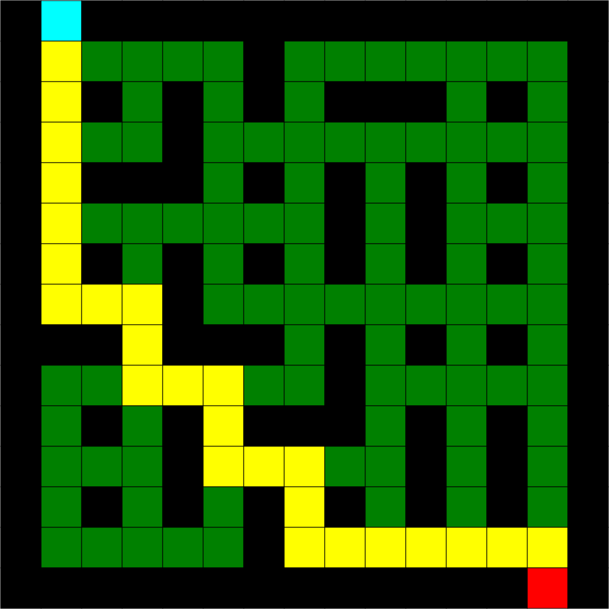

# PathFinding

## Description
This is a program that allows you to place obstacles or generate a maze and use one of four path finding algorithims to solve it. 
## How to Download and Run
Download the download folder to your computer and double click the run.bat file. Alternatively you can open up your command prompt and type the command java -jar PathFinding.jar or java -jar "path\to\PathFinding.jar" .
## Features 
* Object Oriented Programming
* Recursion
* Exception Handling
* File Output
* Data Structures - Linked List, Stack
* JavaFX
* Four Pathfinding Algorithms
* One Maze Generating Algorithm
* Customizable Maze Sizes
## Controls
To place a barrier left click on any square on the scene. To remove a barrier right click on a square. To place many barriers you can hold shift and move your mouse over the squares you want to place a barrier on. You can also remove many barriers by holding ctrl and hovering your mouse over a square. Place the entrance and/or exit by clicking the entrance and\or exit button and left clicking any square on the screen. The clear obstacles button will reset the screen completely. The clear board button will remove any squares placed by the path finding algorithms. To start the finding pick an algorithim from the dropdown box an click run. You can also save an image of your maze by typing in a name for your file and hitting save.
## Algorithms 
## Dijkstra's algorithm
Time space: O(ElogV)
This alorthim works by assigning all values to an arbitrarily high value and setting the value of the starting node to 0. With that it then evaulates the move cost to its neighbors and sets the neigbors parent node to itself and then adds them to a priority queue. I implemeted a linked list for my program. It will then call the function again with the next node with the smallest move cost. If the move cost of one of its neighbors is lower then the one already stored it will update that value and set the parent to itself. This will continue until the exit is reached or the list of nodes runs out.
## A*
Time space:O(b^d)
This is very similar to Dijkstra's except that it knows where the exit node is. It factors that into the move cost. The process is similar but it will evaluate less nodes as it will try and move directly to the exit.
## Depth First
Time space:O(v+e)
This algorithm works by implementing a stack(first in last out). It will check a node and see what direction it can travel. If it can travel in a direction it will add the node in that direction to the stack. It will continue until it can no longer continue tin that direction. It will then check the nodes in the stack to see if it can go in any other direction before poping it. Two disadvantages of this algorithim is that it is not garenteed to find the shortest path and it will not travel diagonally.
## Breadth First 
Time space:O(b^d)
This is simiar to depth first but it uses a queue(first in first out). For my implementation I used a priority linked list to increase performance. This does not travel diagonally and is generally slower than depth first.
## Prim's Algorithm(Maze Generation)
"Choose a starting cell in the field and add it to the path set.
While there is cell to be handled in the set:
1. Randomly connect to one of the already connected neighbor.
2. Add all unconnected neighbors to the set"(https://hurna.io/academy/algorithms/maze_generator/prim_s.html)

I used a slight variation of this algorithim to generate the mazes.
## Contact
brendencho44@gmail.com
